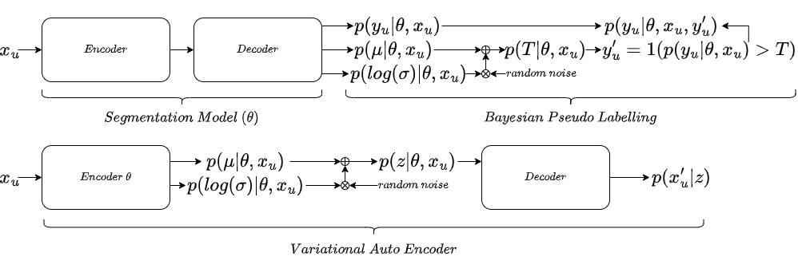
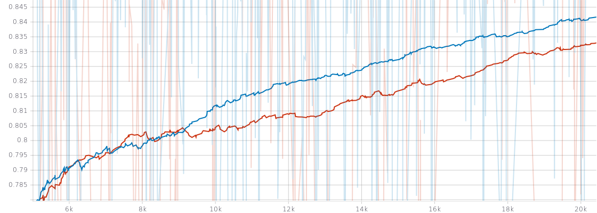

### News

[2022 Sep 21th] Bayesian Pseudo Label was selected and shortlisted for Young Scientist Award (Best Paper) at MICCAI 2022 main conference (15 finalists / 1825 submissions).

### Introduction
This repository is an exampler implementation of our MICCAI 2022 paper on 3D binary segmentation (Runner-up for the best paper (Young Scientist Award)) '[Bayesian Pseudo Labels: Expectation Maximization and Maximization for Robust and Efficient Semi-Supervised Segmentation](https://arxiv.org/abs/2208.04435)'. This code base was written and maintained by [Moucheng Xu](https://moucheng2017.github.io/)

### Pseudo Labelling as Expectation Maximization (EM)
We focus on binary case here that output of a network model is single channel and normalised by Sigmoid function. 
We first see pseudo labels as latent variables of a graphical model. 
The original pseudo labelling is an empirical estimation of E-step for estimating the latent variables, updating model parameter using pseudo labells is the M-step.
We further simplify the graphical model by using only the confidence threshold as a latent variable.
See the illustration below:


### Bayesian Pseudo Labels
Bayesian pseudo label (BPL) is a probabilistic generalisation of pseudo labelling via Bayes rule. Because the full E-step is intractable (more details in our paper), BPL estimates the maximum likelihood of labels of unlabelled data with variational inference. The comparison between Bayesian pseudo label and Variational auto encoder is illustrated beneath: 



The two key differences between BPL and VAE are: 1) BPL has only one latent variable which has a clear prior, while VAE has high dimensional latent variables without a clear prior; 2) VAE does MAP estimation of reconstruction of input image, while BPL does MAP estimation of unseen label of input image.


### Results
The beneath picture is a plot of the learnt threshold with a prior of an univariate Gaussian (mean=0.5, std=0.16). X-axis: training iterations; Y-axis: threshold. 


The beneath picture is a plot of the training curves of BPL (Blue) and supervised learning (Red) on
a binary segmentation of 3D brain tumour task on Task01 Brain Tumour from Medical Decathlon website http://medicaldecathlon.com/. We used case 1-8 from training data as labelled training data
and we kept the rest of the original data as testing data. We used all of the unlabelled testing data as unlabelled training data. 
The training curve looks noisy because the batch size is 1, we suggest future users to use large batch size if you have big GPU to avoid noisy training.


### Installation and Usage
This repository is based on PyTorch 1.4. To use this code, please first clone the repo and install the enviroment.
In order to use this code on your own dataset, if the volumetric data is in (H x W x D), please set up the flag "transpose_dim" in your config yaml file as 1. If the data is in (D x H x W), set "transpose_dim" as 0.
you will also have to prepare your dataset in a structure following:

```
path_to_dataset
└───labelled
|   └───imgs # labelled scans. 
|   └───lbls # labels 
└───unlabelled
|   └───imgs # unlabelled scans
└───test
    └───imgs # testing scans
    └───lbls # testing labels
```

Then to train the model, call the following with your own custom yaml config file:
   ```shell
   python main.py \
   -c config/exp.yaml
   ```
Here is an example of the config yaml file:
```
dataset:
  name: lungcancer
  num_workers: 4
  data_dir: '/SAN/medic/PerceptronHead/data/Task06_Lung' # data directory
  data_format: 'nii' # use nii for nifti, use npy for numpy

logger:
  tag: 'exp_log'

seed: 1024

model:
  input_dim: 1 # channel number of the input volume. For example, 1 for CT, 4 for BRATS
  output_dim: 1 # output channel number, 1 for binary for using Sigmoid
  width: 8 # number of filters in the first encoder, it doubles in every encoder
  depth: 3 # number of downsampling encoders

train:
  transpose_dim: 1 # use 1 for transposing input if input is in: D x H x W. For example, for Task06_Lung from medicaldecathlon, this should be 1
  optimizer:
    weight_decay: 0.0005
  lr: 0.001
  iterations: 10000 # number of training iterations, it's worth to mention this is different from epoch
  batch: 1 # batch size of labelled volumes
  temp: 1.0 # temperature scaling on output, default as 1
  contrast: True # random contrast augmentation
  crop_aug: True # random crop augmentation
  gaussian: True # random gaussian noise augmentation
  new_size_d: 32 # crop size on depth (number of slices)
  new_size_w: 256 # crop size on width
  new_size_h: 256 # crop size on height
  batch_u: 1 # this has to be zero in supervised setting, if set up larger than 0, semi-supervised learning will be used
  mu: 0.5 # prior of the mean of the threshold distribution, we automatically scale the standard deviation, see libs.Loss.kld_loss for details
  learn_threshold: 1 # 0 for using the original fixed pseudo label, 1 for learning pseudo label threshold
  threshold_flag: 1 # 0 for the original implementation of bayesian pseudo label, 1 for a simplified implementation which approximates mean and learns the variance
  alpha: 1.0 # weight on the unsupervised learning part if semi-supervised learning is used
  warmup: 0.1 # ratio between warm-up iterations and total iterations
  warmup_start: 0.1 # ratio between warm-up starting iteration and total iterations

checkpoint:
  resume: False # resume training or not
  checkpoint_path: '/some/path/to/saved/model' # checkpoint path
```

### Different implementations of K-L loss of Bayesian Pseudo Labels:
There are two implementations of kl loss of the threshold of the pseudo labels. See the exact KL loss implementations in libs.Loss.kld_loss
1. The original implementation with hyperparameter searching of prior of mean (mu) (MICCAI version). To use the original Bayesian pseudo labels, set up "learn_threshold" as 1
and "threshold_flag" as 0. The standard deviation prior is approximated as min [(1 - mu_prior) / 3, mu_prior / 3]. 

2. The simplified Bayesian pseudo label without hyperparameter searching of prior of mean (mu). The mu_prior is approximated as Exp[.] of prediction probability. The standard deviation prior
is still approximated as min [(1 - mu_prior) / 3, mu_prior / 3]. 

Other alternative implementations with suitable assumptions could also be used to simplify the K-L loss.

### On the learnt threshold
We learn each threshold scalar for each image in the current implementation before we average them across batch. See the output of libs.Train3D.calculate_kl_loss

### Example Use:
Task06_Lung from medicaldecathlon.com

### Citation

If you find our paper or code useful for your research, please consider citing:

    @inproceedings{xu2022bpl,
         title={Bayesian Pseudo Labels: Expectation Maximization and Maximization for Robust and Efficient Semi-Supervised Segmentation},
         author={Xu, Moucheng and Zhou, Yukun and Jin, Chen and deGroot, Marius and Alexander, Daniel C. and Oxtoby, Neil P. and Hu, Yipeng and Jacob, Joseph},
         booktitle = {International Conference on Medical Image Computing and Computer Assisted Interventions (MICCAI)},
         year = {2022} }


### Questions
Please contact 'xumoucheng28@gmail.com'


### Ackwnoledgement
Massive thanks to my amazing colleagues at UCL and GSK including Yukun Zhou, Jin Chen, Marius de Groot, Fred Wilson, Danny Alexander, Neil Oxtoby, Yipeng Hu and Joe Jacob.
