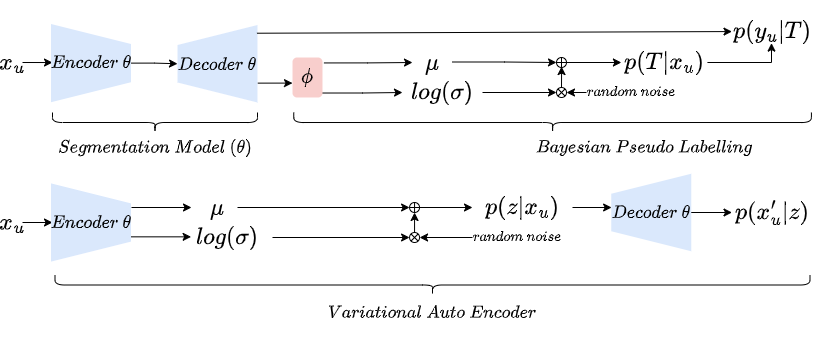

### News
[2022 Sep 21th] Bayesian Pseudo Label was selected and shortlisted for Young Scientist Award (Best Paper) at MICCAI 2022 main conference (15 finalists / 1825 submissions).

[2022 Oct 21th] We release the implementation of the model and a training script with three improvements. The three improvements are:
a) 2.5D training, each iteration trains slices sampled from three orthogonal planes of the input volume;
b) augmentation techniques such as cutout, random contrast, random zoom in and random Gaussian noises, different augmentation are weighted sum with weighs sampled from Dirichlet distribution;
c) new training schedule, 50 steps only supervised learning then linear warm-up of the weighting for unsupervised learning on pseudo labels.

### Introduction
This repository is an implementation of our MICCAI 2022 paper (Runner-up for the best paper (Young Scientist Award)) '[Bayesian Pseudo Labels: Expectation Maximization and Maximization for Robust and Efficient Semi-Supervised Segmentation](https://arxiv.org/abs/2208.04435)'. This code base was written and maintained by [Moucheng Xu](https://moucheng2017.github.io/)

### Pseudo Labelling as Expectation Maximization (EM)
We focus on binary case here that output of a network model is single channel and normalised by Sigmoid function. 
We first see pseudo labels as latent variables of a graphical model. 
The original pseudo labelling is an empirical estimation of E-step for estimating the latent variables, updating model parameter using pseudo labells is the M-step.
We further simplify the graphical model by using only the confidence threshold as a latent variable.
See the illustration below:


### Bayesian Pseudo Labels
Bayesian pseudo label (BPL) is a probabilistic generalisation of pseudo labelling via Bayes rule. Because the full E-step is intractable (more details in our paper), BPL estimates the maximum likelihood of labels of unlabelled data with variational inference. The comparison between Bayesian pseudo label and Variational auto encoder is illustrated beneath: 



The two key differences between BPL and VAE are: 1) BPL has only one latent variable which has a clear prior, while VAE has high dimensional latent variables without a clear prior; 2) VAE does MAP estimation of reconstruction of input image, while BPL does MAP estimation of unseen label of input image.

### Installation and Usage
This repository is based on PyTorch 1.4. To use this code, please first clone the repo and install the enviroment.
In order to use this code on your dataset, you will have to resample and store all of your scans to isotropic (H=W=D) and prepare your dataset in a structure following:
```
path_to_dataset
└───labelled
|   └───imgs # (H x W x D) nii.gz* isotropic nifti volumes of scans
|   └───lbls # (H x W x D) nii.gz* isotropic nifti volumes of labels 
└───unlabelled
|   └───imgs # (H x W x D) nii.gz* isotropic nifti extra volumes of scans
└───test
    └───imgs # (H x W x D) nii.gz* isotropic nifti unseen volumes of scans
    └───lbls # (H x W x D) nii.gz* isotropic nifti labels of unseen scans
```

Then to train the model with default hyperparameter, use:
   ```shell
   cd EMSSL
   python Run.py
   --data 'path/to/your/numpy_dataset' 
   --log_flat 'your log flag'
   --mu 0.5
   ```
However, we recommand users to tune --mu

### Citation

If you find our paper or code useful for your research, please consider citing:

    @inproceedings{xu2022bpl,
         title={Bayesian Pseudo Labels: Expectation Maximization and Maximization for Robust and Efficient Semi-Supervised Segmentation},
         author={Xu, Moucheng and Zhou, Yukun and Jin, Chen and deGroot, Marius and Alexander, Daniel C. and Oxtoby, Neil P. and Hu, Yipeng and Jacob, Joseph},
         booktitle = {International Conference on Medical Image Computing and Computer Assisted Interventions (MICCAI)},
         year = {2022} }


### Questions
Please contact 'xumoucheng28@gmail.com'


### Ackwnoledgement
Massive thanks to my amazing colleagues at UCL and GSK including Yukun Zhou, Jin Chen, Marius de Groot, Fred Wilson, Danny Alexander, Neil Oxtoby, Yipeng Hu and Joe Jacob.
