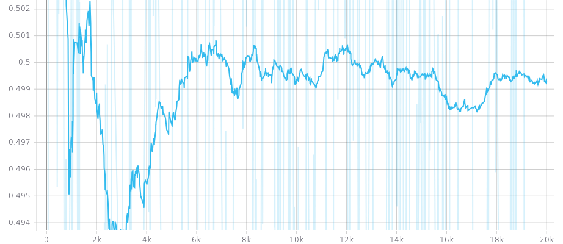

### News

[2023 May 1st] A journal extension has been released here: https://arxiv.org/abs/2305.01747

[2023 Mar 23th] New KL loss updated in libs.Loss. The new k-l loss measure k-l distance of any two arbitrary Gaussian dist.
We added a few flags for the k-l loss, when all flags set up as 0, the k-l loss becomes the one used in our MICCAI paper. 
You can set up flags to other options to choose to learn mean or std or choose not to learn mean or std.

[2022 Sep 21th] Bayesian Pseudo Label was selected and shortlisted for Young Scientist Award (Best Paper) at MICCAI 2022 main conference (15 finalists / 1825 submissions).

### Introduction
This repository is an exampler implementation of our MICCAI 2022 paper on 3D binary segmentation (Runner-up for the best paper (Young Scientist Award)) '[Bayesian Pseudo Labels: Expectation Maximization and Maximization for Robust and Efficient Semi-Supervised Segmentation](https://arxiv.org/abs/2208.04435)'. This code base was written and maintained by [Moucheng Xu](https://moucheng2017.github.io/)

### Pseudo Labelling as Expectation Maximization (EM)
We focus on binary case here that output of a network model is single channel and normalised by Sigmoid function. 
We first see pseudo labels as latent variables of a graphical model. 
The original pseudo labelling is an empirical estimation of E-step for estimating the latent variables, updating model parameter using pseudo labells is the M-step.
We further simplify the graphical model by using only the confidence threshold as a latent variable.
See the illustration below:


### Bayesian Pseudo Labels
Bayesian pseudo label (BPL) is a probabilistic generalisation of pseudo labelling via Bayes rule. Because the full E-step is intractable (more details in our paper), BPL estimates the maximum likelihood of labels of unlabelled data with variational inference. The comparison between Bayesian pseudo label and Variational auto encoder is illustrated beneath: 


The two key differences between BPL and VAE are: 1) BPL has only one latent variable which has a clear prior, while VAE has high dimensional latent variables without a clear prior; 2) VAE does MAP estimation of reconstruction of input image, while BPL does MAP estimation of unseen label of input image.


## Exemplar Results
The beneath table is the results on binary segmentation of whole tumour using Task01 Brain Tumour. We use the first 8 cases from the original training data
as labelled training cases and the rest as testing data, we use the original unlabelled testing data as unlabelled training data.

| Test Sizing | 32^3  | 64^3  | 96^3  | 128^3 |
|-------------|-------|-------|-------|-------|
| Superivsed  | 61.07 | 66.94 | 70.13 | 72.09 |
| SegPL-VI    | 64.44 | 71.43 | 73.07 | 74.48 |

The beneath picture is a plot of the learnt threshold with a prior of an univariate Gaussian (mean=0.5, std=0.16). X-axis: training iterations; Y-axis: threshold. 


### Installation 
This repository is based on PyTorch 1.4. To use this code, please first clone the repo and install the enviroment.

### Prepare the datasets
This code base is for 3D volumetric data sets. If each of your scans is in (H x W x D), please set up the flag "transpose_dim" in your config yaml file as 1. 
If each scan is in (D x H x W), set "transpose_dim" as 0. This code base works either numpy or nifti data formats. To use numpy, set up the
flag "dataset.data_format" as 'npy', to use nifity, set up the flag "dataset.data_format" as 'nii'. 
You also need to prepare your dataset in a structure following:

```
path_to_dataset
└───labelled
|   └───imgs # labelled scans. 
|   └───lbls # labels 
└───unlabelled
|   └───imgs # unlabelled scans
└───test
    └───imgs # testing scans
    └───lbls # testing labels
```

### Training and config files:
Run the following with your own custom yaml config file:
   ```shell
   python main.py \
   -c configs/exp.yaml
   ```
Here is an example of the configuration .yaml file:
```
dataset:
  name: brain
  num_workers: 8 
  data_dir: '/SAN/medic/PerceptronHead/data/Task01_BrainTumour'
  data_format: 'nii'

logger:
  tag: 'cluster_brain'

seed: 1024

model:
  input_dim: 4
  output_dim: 1
  width: 10
  depth: 3

train:
  transpose_dim: 1 # use 1 for transposing input if input is in: D x H x W. For example, for Task06_Lung from medicaldecathlon, this should be 1
  optimizer:
    weight_decay: 0.0005
  lr: 0.001
  iterations: 25000 # number of training iterations, it's worth to mention this is different from epoch
  batch: 2 # batch size of labelled volumes
  temp: 1.0 # temperature scaling on output, default as 1
  contrast: False # random contrast augmentation
  crop_aug: True # random crop augmentation
  gaussian: False # random gaussian noise augmentation
  new_size_d: 32 # crop size on depth (number of slices)
  new_size_w: 128 # crop size on width
  new_size_h: 128 # crop size on height
  batch_u: 1 # this has to be zero in supervised setting, if set up larger than 0, semi-supervised learning will be used
  pri_mu: 0.7 # mean of prior
  pri_std: 0.15 # std of prior
  flag_post_mu: 0 # flag for mean of posterior
  flag_post_std: 0 # flag for std of posterior
  flag_pri_mu: 0 # flag for mean of prior
  flag_pri_std: 0 # flag for std of prior
  alpha: 1.0 # weight on the unsupervised learning part if semi-supervised learning is used
  warmup: 0.1 # ratio between warm-up iterations and total iterations
  warmup_start: 0.4 # ratio between warm-up starting iteration and total iterations
  beta: 1 # weight for pseudo supervision loss
  conf_lower: 0.0 # lower bound for confidence threshold

checkpoint:
  resume: False # resume training or not
  checkpoint_path: '/some/path/to/saved/model' # checkpoint path
```


### Hyper-parameters of the K-L loss of Bayesian Pseudo Labels
To use semi-supervised learning, please enable the batch of unlabelled images larger than 0: batch_u: # positive integer. 
In kl_loss, we now included more flexible controls and different implementations of kl loss of the threshold of the pseudo labels. See the exact KL loss implementations in libs.Loss.kld_loss or kl_loss_test.py

1. To use the original implementation of bayesian pseudo labels from the MICCAI version. set up following flags: 
   1. flag_post_mu: 0
   2. flag_post_std: 0
   3. flag_pri_mu: 0
   4. flag_pri_std: 0

2. We provide an alternative of use current model prediction confidence as prior so you don't need to tune pri_mu and pri_std. To test this configuration, please
set up the following flags as:
   1. flag_post_mu: 0
   2. flag_post_std: 0
   3. flag_pri_mu: 1
   4. flag_pri_std: 1

3. To use random sampling from prior dist for the threshold, without learning the kl,
please set up the following flags as:
   1. flag_post_mu: 2
   2. flag_post_std: 2
   3. flag_pri_mu: 0
   4. flag_pri_std: 0

3. To use supervised learning, simply set up batch_u: 0

### Example uses:
This code base has been tested on whole tumour segmentation on Task 01 brain tumour data set downloaded from Medical Segmentation Decathlon: http://medicaldecathlon.com/

### Citation

If you find our paper or code useful for your research, please consider citing:

    @inproceedings{xu2022bpl,
         title={Bayesian Pseudo Labels: Expectation Maximization and Maximization for Robust and Efficient Semi-Supervised Segmentation},
         author={Xu, Moucheng and Zhou, Yukun and Jin, Chen and deGroot, Marius and Alexander, Daniel C. and Oxtoby, Neil P. and Hu, Yipeng and Jacob, Joseph},
         booktitle = {International Conference on Medical Image Computing and Computer Assisted Interventions (MICCAI)},
         year = {2022} }


### Questions
Please contact 'xumoucheng28@gmail.com'

### Ackwnoledgement
Massive thanks to my amazing colleagues at UCL and GSK including Yukun Zhou, Jin Chen, Marius de Groot, Fred Wilson, Danny Alexander, Neil Oxtoby, Yipeng Hu and Joe Jacob.
